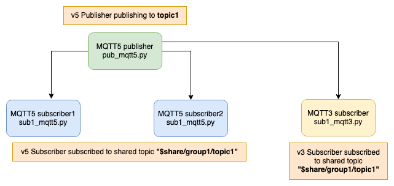

# MQTT5 Shared Subscriptions demo

**Note** : Using AWS IoT Device SDK v2 for Python

Reference : https://github.com/aws/aws-iot-device-sdk-python-v2

# Testing status

| Publisher | Subscriber | Status |
| --- | --- | --- |
| MQTTV5 | MQTTV5 |  |
| MQTTV3 | MQTTV3 |  |
| MQTTV5 | MQTTV3 |  |
